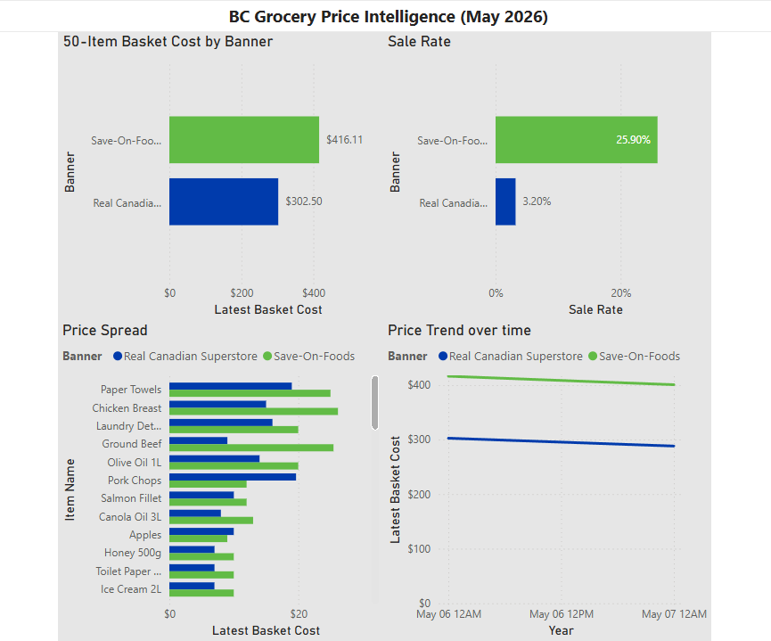

# BC Grocery Price Intelligence

A data pipeline that tracks weekly grocery prices across BC banners and surfaces pricing patterns through a Power BI dashboard. Built as a companion to [GroceryGenie](https://github.com/mackcutlerdev/Grocery-Genie).

## What it does

- Scrapes prices for 50 staple items from Real Canadian Superstore and Save-On-Foods weekly
- Stores price history in PostgreSQL (Supabase) for time-series analysis
- Runs automatically every Monday via GitHub Actions
- Visualizes basket cost, price spread, and sale behavior in Power BI

## Key findings (May 2026)

- Save-On-Foods is **$113 more expensive** than Superstore for the same 50-item basket ($416 vs $303)
- Save-On runs sales on **26% of items** vs Superstore's **3%** -- classic high-low pricing strategy
- Biggest gaps: Paper Towels, Chicken Breast, Ground Beef, and Laundry Detergent

## Dashboard



## Tech stack

| Layer | Tool |
|---|---|
| Scraping | Python 3.11, Requests |
| Storage | PostgreSQL via Supabase |
| Orchestration | GitHub Actions (weekly cron) |
| Dashboard | Power BI Desktop |

## Project structure
├─ src/
├─ scrapers/
├─ superstore.py
├─ saveon.py
├─ db/
├─ schema.sql
├─ insert.py
├─ queries.py
├─ seed_products.py
├─ models.py
├─ data/
├─ basket.csv
├─ .github/
├─ workflows/
├─ scrape.yml

## Setup

### Prerequisites
- Python 3.11+
- A Supabase project (free tier works)
- Power BI Desktop

### Install

```bash
git clone https://github.com/mackcutlerdev/Grocery-Price-Intelligence
cd Grocery-Price-Intelligence
python -m venv .venv && .venv\Scripts\activate
pip install -r requirements.txt
```

### Configure

Create a `.env` file in the project root:
```
DATABASE_URL=your-supabase-connection-string
SUPABASE_URL=https://your-project.supabase.co
SUPABASE_KEY=your-anon-key
```

### Initialize the database

```bash
python -m src.db.seed_products
```

### Run scrapers

```bash
python -m src.scrapers.superstore
python -m src.scrapers.saveon
```